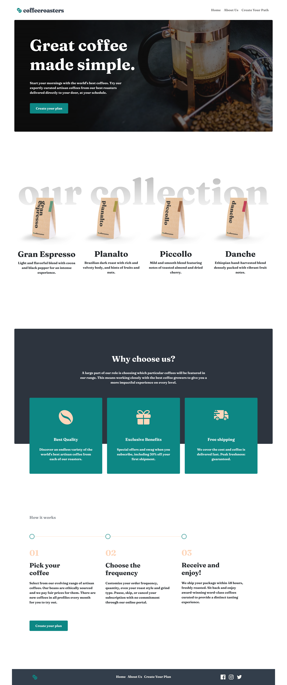

# Coffeeroasters subscription site

## Table of contents

- [Overview](#overview)
  - [The challenge](#the-challenge)
  - [Screenshot](#screenshot)
  - [Links](#links)
- [My process](#my-process)
  - [Built with](#built-with)
  - [What I learned](#what-i-learned)
  - [Continued development](#continued-development)
- [Author](#author)

## Overview

### The challenge

Users should be able to:

- View the optimal layout for each page depending on their device's screen size
- Make selections to create a coffee subscription and see an order summary modal of their choices

### Screenshot

### Links

- FrontEndMentor Solution URL: [FEMSolution](https://www.frontendmentor.io/solutions/coffee-roasters-solution-myWNrWs6y)
- Live Site URL: [CoffeeRoasters](https://mj-coffeeroasters.netlify.app/)

## My process

### Built with

- JSX
- CSS custom properties
- BootStrap
- Flexbox
- BootStrap Grid
- Mobile-first workflow
- [React](https://reactjs.org/) - JS library

### What I learned

During this process I learned a lot about media queries and responsiveness. This was also a very design driven website with little things here and there that really lead to the overall feel of the site such as negative margin and padding vs margin differences. Additionally, on the React side of things I learned how to pass and update state from a child component to a parent using function callbacks.

### Continued development

In future projects I'd like to implement SASS and back end things with node.js and express. Additionally, I think a user database with login functions would be perfect here for repeat orders and user customization to save their preferences. 

## Author

- Website - [Matthew Jovenal - GitHUb](https://github.com/GuppyForLife)
- Twitter - [@YoursTruly_Matt](https://twitter.com/YoursTruly_Matt)
